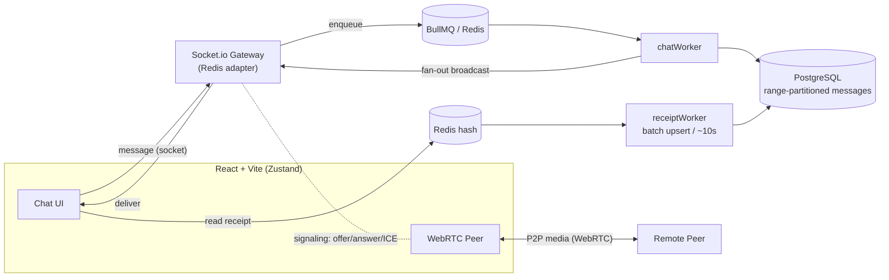

# Nexus Chat — Real-Time Communication Platform


> A full-stack, real-time chat platform with **1-on-1 WebRTC video calls**, **write-behind read receipts**, and **queue-backed message delivery** — engineered so the WebSocket layer never blocks on the database.

Nexus Chat is less about CRUD and more about the hard parts of real-time systems: keeping the socket gateway responsive under load, persisting messages durably without backpressure, and updating read-status at high frequency without hammering the database.

---

## Highlights

- **Queue-decoupled messaging** — incoming messages are acknowledged instantly and pushed to a **BullMQ** queue; a separate worker persists them to Postgres and fans them out, so a slow DB never freezes the chat.
- **Write-behind read receipts** — read-status updates land in a **Redis** hash and are batch-upserted to Postgres every ~10s by a background worker, cutting read-receipt DB write load by **~99%** in heavy chats.
- **Peer-to-peer video** — native **WebRTC** (mesh) with Socket.io used purely for signaling (offer / answer / ICE) and Google STUN for NAT traversal — no third-party video SDK.
- **Horizontally scalable sockets** — Socket.io runs with the **Redis adapter**, so the gateway can scale to multiple instances.
- **Range-partitioned messages** — the messages table is partitioned by time for scalable historical reads.
- **Hardened API** — JWT auth (bcrypt-hashed passwords), `helmet`, CORS, and `rate-limiter-flexible` request throttling.

## Architecture



## Tech stack

**Backend** — Node.js, Express 5, PostgreSQL (Sequelize 6), Redis, BullMQ, Socket.io (+ `@socket.io/redis-adapter`), Cloudinary (media via Multer), JWT (`jsonwebtoken`) + `bcryptjs`, `helmet`, `morgan`, `rate-limiter-flexible`.

**Frontend** — React (Vite), Tailwind CSS, Zustand, Framer Motion, Axios, `socket.io-client`.

## Repository layout

```
nexus-chat/
├── backend/
│   ├── server.js              # app bootstrap: routes, sockets, workers, DB
│   ├── config/database.js     # Sequelize config
│   ├── controllers/           # authController, messageController (get/react/search)
│   ├── routes/                # auth, upload
│   ├── sockets/               # Socket.io init + WebRTC signaling + presence/typing
│   ├── workers/               # chatWorker (persist+fanout), receiptWorker (write-behind)
│   ├── lib/                   # queue (BullMQ), redis, rateLimiter, cloudinary
│   └── db/                    # models, migrations, seeders
│       └── models/            # user, conversation, conversationParticipant, message, messageReaction
└── frontend/
    └── src/                   # pages, store (Zustand), api, lib
```

## Getting started

### Prerequisites
- Node.js 18+ · PostgreSQL 14+ · Redis (running locally or via Docker)

### 1. Backend

```bash
cd backend
npm install
```

Create `backend/.env`:

```env
PORT=5001
NODE_ENV=development

# Database
DB_USERNAME=postgres
DB_PASSWORD=
DB_NAME=nexus_chat
DB_HOST=127.0.0.1
DB_DIALECT=postgres

# Auth
JWT_SECRET=replace_with_a_long_random_string

# Cloudinary (media uploads)
CLOUDINARY_CLOUD_NAME=your_cloud_name
CLOUDINARY_API_KEY=your_api_key
CLOUDINARY_API_SECRET=your_api_secret

# Redis
REDIS_URL=redis://127.0.0.1:6379
```

Create the database and run migrations, then start the server:

```bash
npx sequelize-cli db:create
npx sequelize-cli db:migrate
npm run dev      # → ✅ Database connected · 🚀 Server on :5001
```

### 2. Frontend

```bash
cd frontend
npm install
npm run dev      # → http://localhost:5173
```

## Implementation deep-dives

**Write-behind read receipts.** Updating Postgres on every "message seen" event creates brutal write pressure in active group chats. Instead, a read marks a key in a Redis hash, the UI updates optimistically, and `receiptWorker` flushes all dirty keys to Postgres in a single batched upsert on an interval — ~99% fewer receipt writes.

**Backpressure-proof delivery.** `chatWorker` consumes messages off BullMQ, persists them, and only then triggers fan-out. The socket acknowledges the sender immediately, so DB latency never stalls the real-time path.

**WebRTC lifecycle.** A strict client-side state machine (`idle → calling → receiving → connected`) manages `RTCPeerConnection` so signaling races don't leave zombie connections.

## License

MIT
